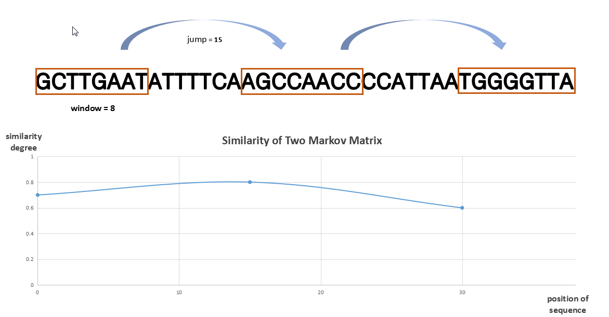
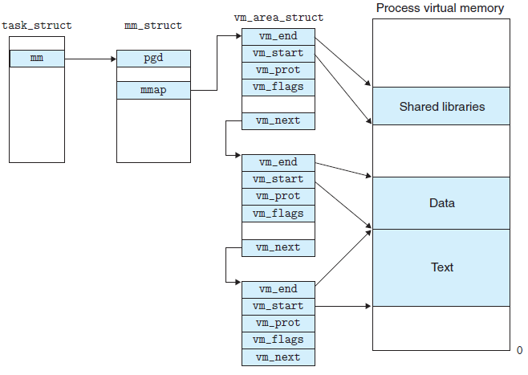

# What is BackSeq Generator?
> In discriminative motif discovery(DMD), TFBS (Transcription Factor Binding sites) patterns be found by common approach that maxmize the model evaluation index. Not only the computational expensive and approximate schemes will restrict the use of potential of the data, but the choose of background sequences will significantly affect the result of DMDs. And it is widely recognized that the background set need to be selected to match statistical performance of foreground sequences.

**BacSeq Generator** is a software that can generate background sequences for DMDs efficiently in short time.

-  Removing statistical features and retaining key features.

    In DMDs, approaches focus on the pattern informations, so another implicit data need to be removed. Here we use the first-order markov matrix to minimize the different between foreground and backgorund sequences.

-  Jump calculation reduces computation time.

    **Jump calculation** can improve the speed of calculation while ensuring the accuracy. At the same time, multiple groups of different TF data can be calculated at the same time, reducing waiting time.

# Features

##  Jump calculation

##  Memory map

# How to use?
1. Download the compressed packet, unzip it.
2. cd /BackseqG
3. make
4. main -j 10 -m 2 -f xx_narrowPeak.bed xx2_narrowPeak.bed -F hg19
